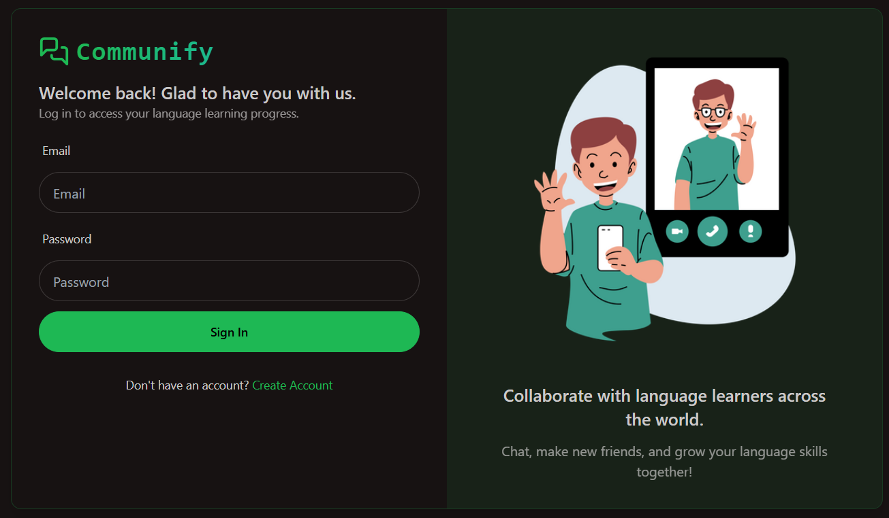
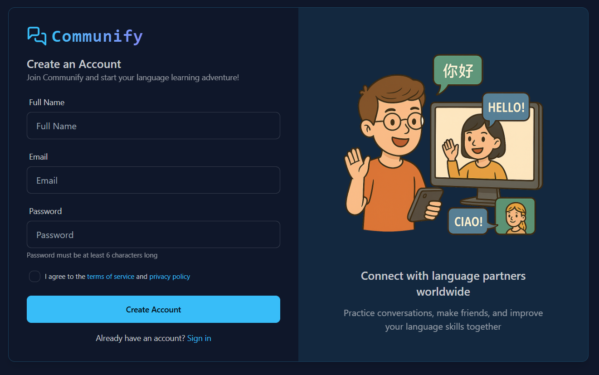
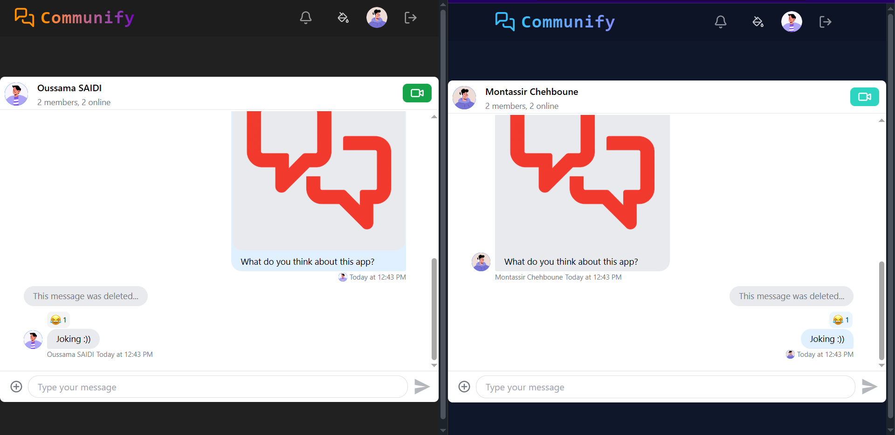
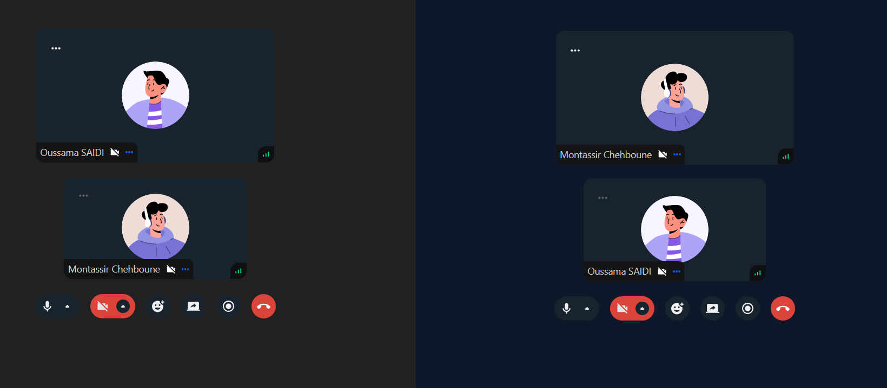

# Communify 💬

**A Full-Stack MERN Social Platform with Real-Time Chat & Video Calls**

Communify is a modern, full-featured social networking platform built with the MERN stack. It features secure JWT-based authentication, real-time one-on-one messaging, peer-to-peer video calls via Stream SDK, and a sleek, customizable UI using Tailwind CSS and DaisyUI themes.

---

## 🔗 Live Demo
> 🌐 Coming soon / [https://communify-app.up.railway.app/]

---

## 🛠️ Tech Stack

### Frontend
- **React.js**
- **Tailwind CSS** + **DaisyUI** (32+ themes)
- **TanStack Query** (React Query)

### Backend
- **Node.js**
- **Express.js**
- **MongoDB**

### Authentication
- **JWT (JSON Web Tokens)**

### Real-Time Features
- **Stream SDK** for Chat & Video Calling

### Deployment
- **Railway**

---

## ✨ Features

- 🔐 **JWT Authentication** – Secure login & signup
- 📄 **User Onboarding** – Setup flow after registration
- 👥 **Friend System** – Send/accept friend requests, user recommendations
- 💬 **Live Chat** – Real-time one-on-one messaging
- 📹 **Video Calling** – Peer-to-peer video communication
- 🎨 **Theming** – 32 UI themes via DaisyUI
- 🚨 **Protected Routes** – Auth guards (frontend & backend)
- 🧰 **Custom Hooks** – Reusable frontend logic
- 🧪 **API Testing** – Robust and tested backend endpoints
- 🚀 **Production Ready** – Easy deploy via Railway

---

## 📸 Screenshots

### 🔐 Login Page

### 📝 Signup Page

### 💬 Conversation View

### 📹 Audio & Video Call Screen

